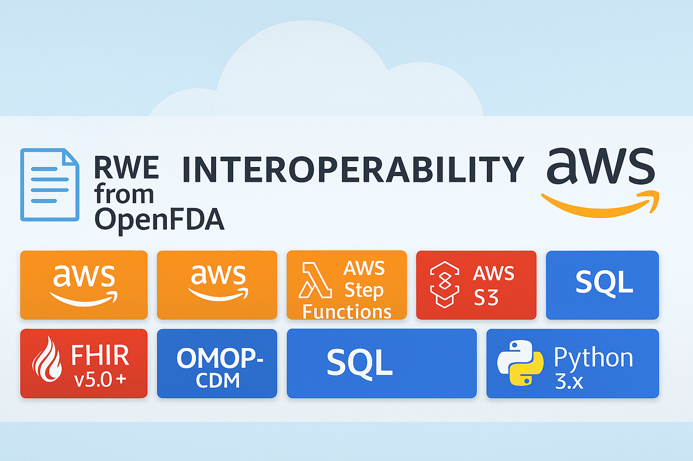

# RWE AWS Integration & Interoperability Pipeline

[](https://aws.amazon.com/)
[](https://docs.aws.amazon.com/lambda/)
[](https://docs.aws.amazon.com/step-functions/)
[](https://docs.aws.amazon.com/s3/)
[](https://docs.aws.amazon.com/athena/)
[](https://www.hl7.org/fhir/)
[](https://ohdsi.github.io/CommonDataModel/)
[](https://en.wikipedia.org/wiki/SQL)
[](https://www.python.org/)

---

### Overview

This repository demonstrates an **end-to-end AWS pipeline** for ingesting real-world data (RWD), transforming it into:
- an **OMOP-ish** tabular structure (`/curated`)
- a **FHIR-ish** JSON representation (`/fhir`)

and enabling analytics using **AWS Athena**, **SQL**, **QuickSight**, and **Python-based ML**.



---

## 📚 Part of the RWE Senior Management Playbook Series

This repository is the **fourth installment** in a coordinated series of playbooks designed for senior leadership, methodologists, and data/AI engineers working with Real-World Evidence (RWE).  

1. **Governance & Analytics**  
   👉 [RWE-governance-and-analytics-playbook-openFDA-clinicaltrials-CDC-OMOP-FHIR-ROI](https://github.com/camontefusco/RWE-governance-and-analytics-playbook-openFDA-clinicaltrials-CDC-OMOP-FHIR-ROI)  
   *Strategy, ROI models, governance frameworks, and integration of multi-source RWD (openFDA, ClinicalTrials, CDC).*

2. **Privacy & Compliance**  
   👉 [Integrated-RWE-Privacy-De-identification-Compliance-HIPAA-GDPR-DUA-and-ROI-Playbook](https://github.com/camontefusco/Integrated-RWE-Privacy-De-identification-Compliance-HIPAA-GDPR-DUA-and-ROI-Playbook)  
   *Privacy-enhancing technologies, HIPAA/GDPR compliance, DUAs, and de-identification pipelines.*

3. **Methods & Evidence**  
   👉 [RWE-Methods-and-Evidence-Playbook](https://github.com/camontefusco/RWE-Methods-and-Evidence-Playbook)  
   *Best practices for study design, causal inference, and evidence frameworks in RWE.*

4. **AI & NLP**  
   👉 [RWE-AI-NLP-Integration-Playbook](https://github.com/camontefusco/RWE-AI-NLP-Integration-Playbook)  
   *Integrating unstructured data and modern NLP/LLM approaches into RWE analytics.*

5. **Integration & Interoperability (AWS-first)** *(this repo)*  
   👉 [RWE-AWS-Integration-Interoperability-Pipeline](https://github.com/camontefusco/RWE-AWS-Integration-Interoperability-Pipeline)  
   *Hands-on, cloud-native AWS pipeline aligned to Anderson et al. (2024) tutorial — ingestion → transformation (OMOP/FHIR) → dashboards → analytics/ML.*

---

### 🔀 Branches

[](https://github.com/camontefusco/RWE-AWS-Integration-Interoperability-Pipeline/tree/main)
[](https://github.com/camontefusco/RWE-AWS-Integration-Interoperability-Pipeline/tree/curated)
[](https://github.com/camontefusco/RWE-AWS-Integration-Interoperability-Pipeline/tree/reports)
[](https://github.com/camontefusco/RWE-AWS-Integration-Interoperability-Pipeline/tree/athena-results)
[](https://github.com/camontefusco/RWE-AWS-Integration-Interoperability-Pipeline/tree/analytics)

| Branch | Description |
|--------|--------------|
| **main** | Core code, documentation, and architecture files |
| **curated** | Example output layout for `/curated` (CSV) and `/fhir` (NDJSON) layers |
| **reports** | Example CSV reports & summary markdown (`interoperability_summary.md`) |
| **athena-results** | Athena query result structure (CSV/Parquet) |
| **analytics** | SQL scripts, notebooks, and analysis examples |

```bash
git fetch --all
git checkout <branch>
```
```graphql
aws/            # Lambda, IaC, and Athena DDL (aws/athena_ddl.sql)
pipeline/       # Transformation logic and schema mapping
diagrams/       # Architecture diagrams
docs/           # Supplementary documentation
samples/        # Sample input data
tests/          # Unit tests (pytest)
ARCHITECTURE.md
DATA_DICTIONARY.md
```
## 🚀 Quickstart
1.Upload sample data to S3
aws s3 cp samples/ s3://<bucket>/raw/ --recursive

2. Define Athena tables
(see aws/athena_ddl.sql for CREATE EXTERNAL TABLE scripts)

4. Run transformations and explore curated / fhir outputs

## 🧪 Testing
```bash
pytest
```
---

## ⚙️ Workflow

- **Ingest** → Upload raw JSON/CSV to **S3** (`/raw`) via **AWS Lambda**  
- **Transform** → **Step Functions** + Lambda produce `/curated` (CSV) and `/fhir` (NDJSON) outputs  
- **Query** → Define **Athena** external tables from [`aws/athena_ddl.sql`](aws/athena_ddl.sql)  
- **Analyze & Report** → Build **QuickSight dashboards**, explore CSVs in [`reports/`](https://github.com/camontefusco/RWE-AWS-Integration-Interoperability-Pipeline/tree/reports), or run notebooks in [`analytics/`](https://github.com/camontefusco/RWE-AWS-Integration-Interoperability-Pipeline/tree/analytics)

---
## 1️⃣ Data Ingestion

- **Source**: Raw JSON/CSV (synthetic or OpenFDA).  
- **Landing**: S3 bucket (`/raw/`).  
- **Lambda**: Polls source or triggered on upload, validates schema, writes to S3 (`/raw/`) or RDS (Postgres).  
- **Security**: S3 encryption, IAM roles, CloudWatch logging, optional de-identification.

## 2️⃣ Data Transformation
Orchestration: AWS Step Functions (stub provided).
Logic: pipeline/transform.py normalizes to OMOP-ish tables and FHIR-ish NDJSON.
Outputs:
S3 /curated/ → OMOP-ish CSV (person, condition_occurrence, observation)
S3 /fhir/ → FHIR-ish NDJSON (Patient, Condition, Observation)

## 3️⃣ Dashboards & Reports
Default: Amazon QuickSight dashboards (connect to Athena or RDS).
Stub: reports/interoperability_summary.md includes sample SQL queries + markdown tables as a lightweight stand-in.

## 4️⃣ Analytics & ML
Baseline: Query curated data in Athena or DuckDB (local test).
Advanced:
SageMaker clustering stub (Kmodes on categorical features).
Optional notebook showing how to load curated data from S3 into SageMaker for analysis.

---

## 🧭 Notes

- “**OMOP-ish**” and “**FHIR-ish**” denote simplified demo subsets, not full production models.  
- Branches represent different pipeline stages (data, reports, analytics) for clarity.  
- Fully compatible with **AWS Serverless Framework** or **AWS SAM** for deployment.  

---

📚 References

Anderson W. et al. (2024), Real-world evidence in the cloud: Tutorial on developing an end-to-end data and analytics pipeline using AWS, Clin Transl Sci, 17:e70078.

OMOP CDM — https://ohdsi.github.io/CommonDataModel/

---

## 📬 Contact
Carlos Montefusco
📧 cmontefusco@gmail.com
🔗 GitHub: /camontefusco
